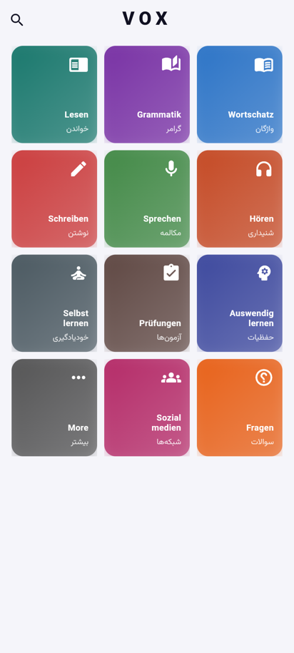

<p align="center">
  
</p>

<h1 align="center">VOX — Deutsch lernen</h1>

<p align="center">
  Kostenlose Web-App zum Deutschlernen für Persischsprachige<br>
  یادگیری رایگان زبان آلمانی برای فارسی‌زبانان · Free German-learning app for Persian speakers
</p>

<p align="center">
  <a href="https://lukasylilli.github.io/vox/"><b>▶ App im Browser öffnen</b></a>
</p>

---



## Was ist VOX?

VOX ist eine offline-first Lern-App für Deutsch (A1–C2), die komplett im Browser läuft —
ohne Installation, ohne Konto, ohne Abo. Die Oberfläche ist auf **Persisch** oder **Englisch**
umschaltbar.

- **Wortschatz** — Vokabelbücher, Wortarten, Niveaus, eigene Wörter
- **Grammatik** — Grammatik-Katalog mit Lektionen, Lückentexten und Quizzes
- **Auswendiglernen** — Konnektoren, Dativ/Akkusativ-Verben, Nomen-Verb-Verbindungen,
  Präpositionen, reflexive, trennbare und unregelmäßige Verben, Modalverben
- **Leitner-Karteikasten** — Wiederholung in 5 Boxen
- **Lesen & Hören** — Texte mit Wort-Popup, aktuelle Nachrichten (Tagesschau, DW), Vorlesen per Sprachausgabe
- **Prüfungen** — Redemittel für Goethe B2, ÖSD B2 und mehr
- **Selbstlernen** — Gewohnheiten, Streaks, Pomodoro-Timer

**Datenschutz:** Es gibt keinen Server und kein Tracking. Fortschritt und eigene Wörter
bleiben im Browser auf deinem Gerät (IndexedDB / localStorage).

<br clear="right">

## Lokal starten

Voraussetzung: [Flutter](https://docs.flutter.dev/get-started/install) **3.44.x** (stable) und Chrome.

```bash
git clone https://github.com/lukasylilli/vox.git
cd vox
flutter pub get
flutter run -d chrome
```

Weitere Befehle:

```bash
flutter analyze                                   # statische Analyse
flutter test                                      # Tests
flutter build web --release --base-href /vox/     # Produktions-Build nach build/web
```

Es werden keine Secrets oder Umgebungsvariablen benötigt (siehe [.env.example](.env.example)).

## Technik

| Bereich | Lösung |
|---|---|
| Framework | Flutter Web |
| State | flutter_riverpod |
| Navigation | go_router (Hash-URLs, funktioniert auf GitHub Pages) |
| Datenbank | drift + SQLite als WebAssembly |
| Audio | just_audio, flutter_tts (Web Speech API) |
| Hosting | GitHub Pages über GitHub Actions |

### Datenbank im Browser

`web/sqlite3.wasm` und `web/drift_worker.js` sind vorkompilierte Dateien aus den Releases von
[sqlite3.dart](https://github.com/simolus3/sqlite3.dart/releases) (`sqlite3-3.3.3`) und
[drift](https://github.com/simolus3/drift/releases) (`drift-2.34.0`). Sie müssen zu den
Versionen in `pubspec.lock` passen. Wer `drift` oder `sqlite3` aktualisiert, lädt die
passenden Dateien aus dem jeweiligen Release neu herunter.

### Deployment

Jeder Push auf `main` startet [`.github/workflows/deploy-web.yml`](.github/workflows/deploy-web.yml):
Analyse → Tests → `flutter build web` → Veröffentlichung auf GitHub Pages.

## Projektstruktur

```
lib/
  core/        Datenbank, Router, Theme, Services, gemeinsame Widgets, L10n
  features/    ein Ordner pro Bereich (wortschatz, grammatik, leitner, …)
assets/
  data/        Lerninhalte als JSON
  vocab/       Vokabel-Archiv, eine JSON-Datei pro Wort
tool/          Vokabel-Importer (siehe import_inbox/README.md)
web/           index.html, Icons, SQLite-WASM
```

## Mitmachen

Beiträge sind willkommen — Code, Inhalte (Vokabeln, Grammatik) und Übersetzungen.

1. Repository forken und einen Branch anlegen: `git checkout -b mein-beitrag`
2. Änderungen machen; `flutter analyze` und `flutter test` müssen grün sein
3. Pull Request mit kurzer Beschreibung öffnen

Neue Vokabeln laufen über den Importer: [import_inbox/README.md](import_inbox/README.md).
Fehler oder Ideen bitte als [Issue](https://github.com/lukasylilli/vox/issues) melden.

## Lizenz

[MIT](LICENSE) — freie Nutzung für alle.

Ausnahme: Die Wortlisten in `old files Lukasalmani/Wörter/` stammen aus
[AlleDeutschenWoerter](https://github.com/cpos/AlleDeutschenWoerter) und stehen unter
der GPL-2.0 (siehe die dortige `LICENSE.txt`).
